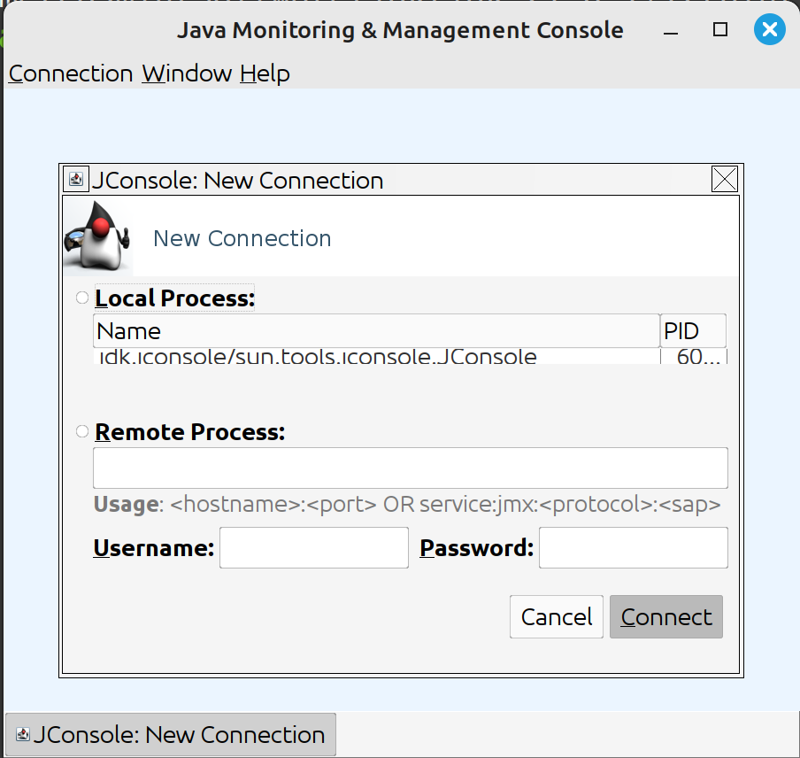
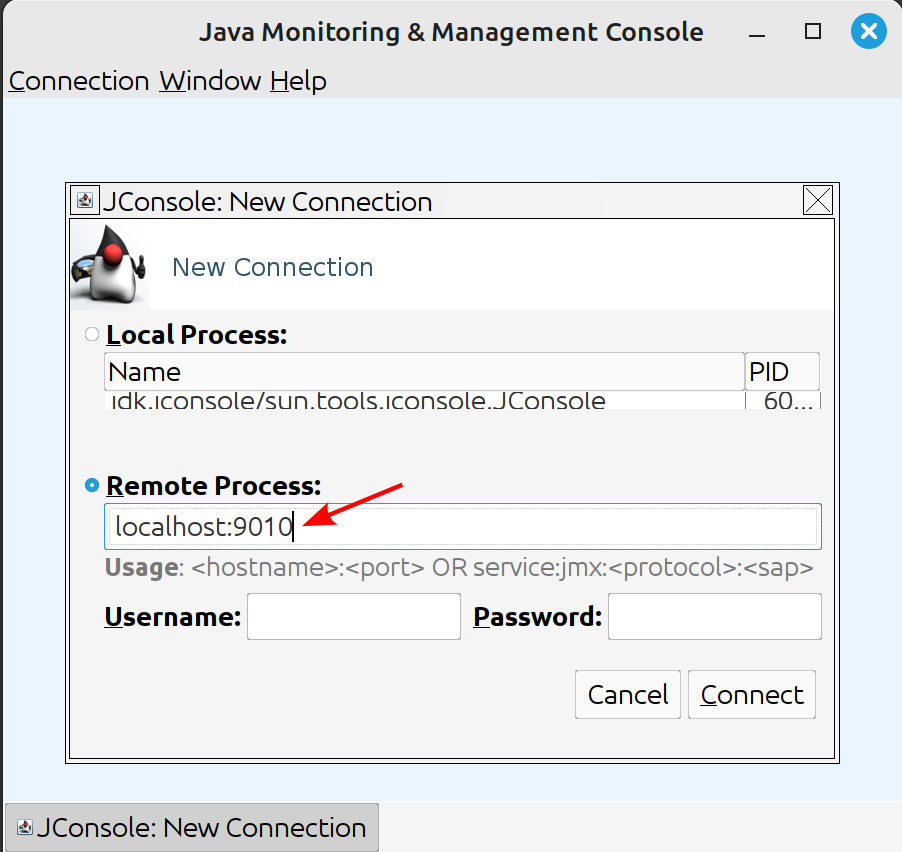
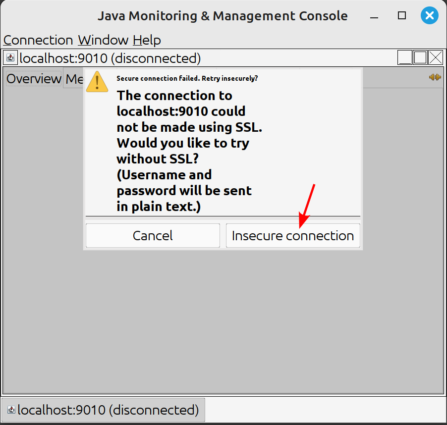
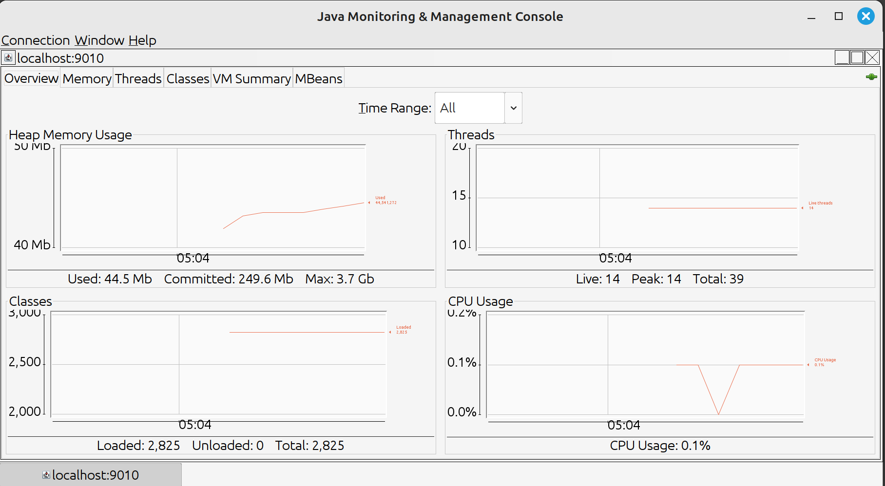

# Using JConsole to connect to an application via JMX

NOTE: The shell commands are for a \*nix operating system (Linux, \*BSD, etc...).  The GUI steps should be the same for all operating systems.

## Installation

The `jconsole` application is included with any JDK (Java Development Kit).  If you have the `JAVA_HOME` environment variable set, you can verify this with:

```shell
ls -la $JAVA_HOME/bin/jconsole
```

Otherwise, you can verify with:

```shell
which jconsole
```

If you don't have a JDK installed, there usually exist instructions for your operating system to install a JDK.  Installing a JRE (Java Runtime Environment) is not enough, as it doesn't include `jconsole`.

## Connect to application via JMX

First, start JConsole by running the binary:

```shell
jconsole
```

This will bring up the initial jconsole window:



Click into the "Remote Process" field and enter the address of your JMX port, in our case `localhost:9010`.
Since we have not setup any authentication, we don't need to enter a username or password.
Then click the "Connect" button to start the connection.




JConsole will warn you about the insecure connection.  Just click the "Insecure connection" button to proceed.



Finally, at this point JConsole will start reading JVM metrics over JMX.  On the main screen you can see memory, threads, classes, and CPU usage:



## Links

* More info about JConsole: [OpenJDK JConsole](http://openjdk.java.net/tools/svc/jconsole/)
